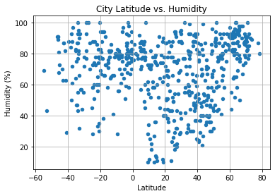
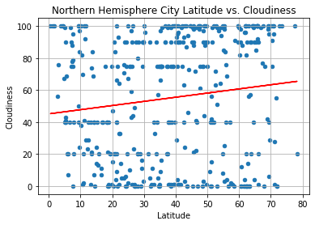

# Python API - What's the Weather Like?

## Background

Whether financial, political, or social -- data's true power lies in its ability to answer questions definitively. In this exercise, utilized what's been learned about Python requests, APIs, and JSON traversals to answer a fundamental question: "What's the weather like as we approach the equator?"

While the answer seems fundamental - it gets hotter - this project utilized data to **prove** it?

## WeatherPy

In this example, created a Python script to visualize the weather of 500+ cities across the world of varying distance from the equator. To accomplish this, utilized a [simple Python library](https://pypi.python.org/pypi/citipy), the [OpenWeatherMap API](https://openweathermap.org/api), and a little common sense to create a representative model of weather across world cities.

Created a series of scatter plots to showcase the following relationships:

* Temperature (F) vs. Latitude
* Humidity (%) vs. Latitude
* Cloudiness (%) vs. Latitude
* Wind Speed (mph) vs. Latitude

Next ran linear regressions on each relationship, only this time separating them into Northern Hemisphere and Southern Hemisphere. Wrote a function that creates the linear regression plots listed below to optimize the code. Plots created were:

* Northern Hemisphere - Temperature (F) vs. Latitude
* Southern Hemisphere - Temperature (F) vs. Latitude
* Northern Hemisphere - Humidity (%) vs. Latitude
* Southern Hemisphere - Humidity (%) vs. Latitude
* Northern Hemisphere - Cloudiness (%) vs. Latitude
* Southern Hemisphere - Cloudiness (%) vs. Latitude
* Northern Hemisphere - Wind Speed (mph) vs. Latitude
* Southern Hemisphere - Wind Speed (mph) vs. Latitude

Below are a few examples of final linear regression plots.

Final notebook:

* Randomly selects **more than** 500 unique (non-repeat) cities based on latitude and longitude.
* Performs a weather check on each of the cities using a series of successive API calls.
* Includes a print log of each city as it's being processed with the city number and city name.
* Saves a CSV of all retrieved data and a PNG image for each scatter plot.